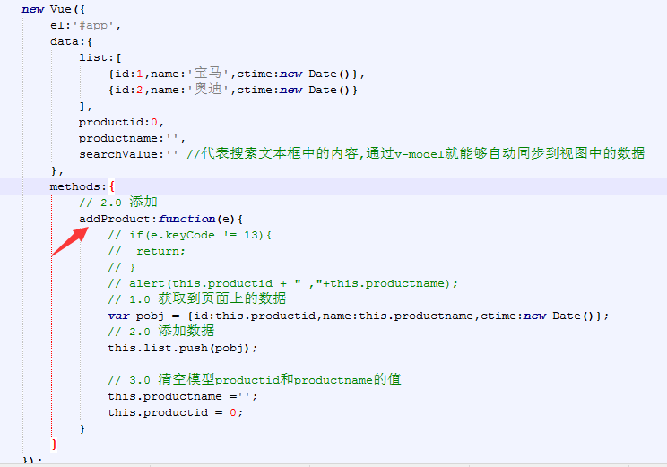
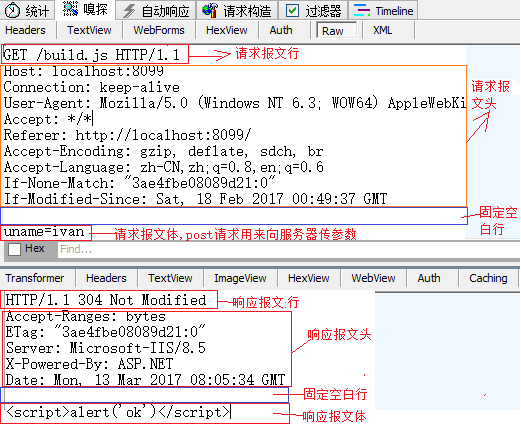

# Vue


```html

<!DOCTYPE html>
<html lang="en">
<head>
    <meta charset="UTF-8">
    <meta name="viewport" content="width=device-width, initial-scale=1.0">
    <meta http-equiv="X-UA-Compatible" content="ie=edge">
    <title>Document</title>
    <script src="../vue1026.js"></script>
    <style>
        #tb{
            width: 800px;
            margin: 20px auto;
            border-collapse: collapse;
        }
        #tb th{
            border: 1px solid black;
            color: white;
            background-color: blue;
        }
        #tb td{
            text-align: center;
            border: 1px solid black;
        }
    </style>
</head>
<body>
    <div id="app">
        <input type="text" v-model="pid">
        <input type="text" v-model="pname">
        <button @click="addData">添加数据</button>

        <table id="tb">
            <tr>
                <th>编号</th>
                <th>品牌</th>
                <th>创建时间</th>
                <th>操作</th>
            </tr>
            <tr v-show="list.length == 0">
                <td colspan="4">暂无数据</td>
            </tr>
            <tr v-for="item in list">
                <td>{{item.id}}</td>
                <td>{{item.name}}</td>
                <td>{{item.ctime | filter 'yyyy-mm-dd'}}</td>
                <td>
                    <a href="javascript:void(0)" @click="deleteData(item.id)">删除</a>
                </td>
            </tr>
        </table>
    </div>
</body>
<script>
    Vue.filter('filter',function(input,fmtString){
        var year = input.getFullYear()
        var month = input.getMonth() + 1;
        var day = input.getDate();

        var res = year + '-' + month + '-' + day;

        if(fmtString == 'yyyy-mm-dd'){
            return res
        }
    })

    var vm = new Vue({
        el:'#app',
        data:{
            list:[
                {id:01,name:'奔驰',ctime:new Date()}
            ],
            pid:0,
            pname:''
        },
        methods:{
            addData:function(){
                // 添加数据
                var obj = {id:this.pid,name:this.pname,ctime:new Date()}

                // 把添加的对象,添加到数组中去
                this.list.push(obj)

                // 清空
                this.pid = 0
                this.pname = ''
            },
            deleteData:function(id){

                if(!confirm('你真的要删吗?')){
                    return;
                }

                // 删除数据
                var index = this.list.findIndex(function(item){
                    return item.id == id
                })

                // 从数组中删除对应的数据
                this.list.splice(index,1)
            }
        }
    })
</script>
</html>
```


## v-on

```html
<body>
    <div id="app">
        {{ title }}
        <button v-on:click="change">按钮</button>
        <button @click="change">另一个按钮</button>
    </div>
</body>
<script>
    new Vue({
        el:'#app',
        data:{
            title:'haha'
        },
        methods:{
            change:function(){
                this.title += 1
            }
        }
    })
</script>
```


```html


<body>
    <!--注意：
        1、利用简介方法进行默认事件的阻止
        2、利用原生的方法，利用事件参数调用e.preventDefault进行默认事件的阻止
    -->
    <div id="app">
        {{ title }}
        <button @click="change">按钮</button>
        <form @click.prevent action="http://www.itcast.cn">
            <!--数据双向绑定-->
            <input type="text" v-model="pname">
            <input type="password" v-model="pass">
            <!--阻止默认提交事件-->
            <input type="submit" @click="jump">
        </form>
    </div>
</body>
<script>
    new Vue({
        el:'#app',
        data:{
            title:'haha',
            pname:'',
            pass:''
        },
        methods:{
            change:function(){
                this.title += 1
            },
            jump:function(e){
                // 利用原生方法进行默认事件阻止
                alert('1')
                // e.preventDefault();
            }
        }
    })
</script>

```


### @click

```html

<body>
    <div id="app">
        <button @click='hehe'>click me</button>
        <div>{{title}}</div>
    </div>
    <script>
        var vm = new Vue({
            el:"#app"
            ,data:{
                title:'今天天气不错!'
            }
            ,methods:{
                hehe:function (title) {
                   return this.title += 1;
                }
            }
        });
    </script>
</body>

```


### v-text   v-html

```html
<body>
    <div id="app">
        <button @click='hehe'>click me</button>
        <div>{{title}}</div>
    </div>
    <script>
        var vm = new Vue({
            el:"#app"
            ,data:{
                title:'今天天气不错!'
            }
            ,methods:{
                hehe:function (title) {
                   return this.title += 1;
                }
            }
        });
    </script>
</body>
```


### v-if  v-show

```
<body>
    <div id="app">
        <!--条件判断：为false页面当中根本没有这个元素-->
        <span v-if="isshow">{{name}}</span>
        <!--show：页面当中有这个元素，只是行内属性为display:none-->
        <span v-show="isshow">{{name}}</span>
        <button @click="btnBeClicked">按钮</button>
    </div>
</body>
<script>
    var vm = new Vue({
        el:"#app"
        ,data:{
            name:'我是名字'
            ,isshow:false
        }
        ,methods:{
            btnBeClicked:function () {
                this.isshow = true;
            }
        }
    })
</script>
```


### v-model 双向绑定

```html
<body>
    <!--实现双向绑定-->
    <div id="app">
        {{name}}
        <input type="text" v-model="name">
        <button @click='move'>click me</button>
    </div>
</body>
<script>
    var vm = new Vue({
        el:'#app'
        ,data:{
            name:'呵呵'
        }
        ,methods:{
            move:function () {
                this.name='嘿嘿';
            }
        }
    })

</script>
```


### v-bind 绑定属性

```html

<head>
    <meta charset="UTF-8">
    <meta name="viewport" content="width=device-width, initial-scale=1.0">
    <meta http-equiv="X-UA-Compatible" content="ie=edge">
    <title>Document</title>
    <script src="vue1026.js"></script>
    <style>
        .one {
            background-color:aqua;
            height:100px;
            width:100px;
        }
    </style>
</head>
<body>
    <div id="app">
        <!--bind主要用于绑定属性，进行属性的添加-->
        <a href="#" v-bind:title="msg">这是个a标签</a>
        
        <a href="#" :title="msg">这是个a标签</a>
       
        <a href="#" :title="msg"  :s="msg">这是个a标签</a>
        <div :class='[one]'></div>
    </div>
</body>
<script>
    var vm = new Vue({
        el:'#app',
        data:{
            msg:'这是title部分的内容'
            ,one:'one'
        }
    })
</script>

```


# 概览

- v-on按键修饰符
- 扩展品牌管理需求来学习新知识点
- Vue中的AJAX请求
- Vue的生命周期方法

## 学习目标

- 掌握v-on事件按键修饰符的作用
- 记住自定义属性指令和元素指令的写法
- 记住自定义过滤器的写法以及管道符|的使用
- 能够分清楚私有过滤器和全局过滤器的应用场景
- 掌握vue-resource中get方法的使用
- 掌握vue-resource中jsonp方法的使用
- 掌握vue-resource中post方法的使用


# 详细内容

## 1 v-on 按键修饰符

### 1.1 作用说明

```
    文档地址：http://cn.vuejs.org/v2/guide/events.html#按键修饰符
    
    在监听键盘事件时，我们经常需要监测常见的键值。 Vue 允许为 v-on 在监听键盘事件时添加按键修饰符：
    .enter
    .tab
    .delete (捕获 “删除” 和 “退格” 键)
    .esc
    .space
    .up
    .down
    .left
    .right
    1.0.8+ 支持单字母按键别名。

```

### 1.2 利用v-on的.enter按键修饰符实现品牌管理的新增按钮功能
- 效果图
  
    


- 实现代码

    
    


## 2 过滤器

```
    Vue提供了一系列的固定逻辑来使程序员更加容易的实现这些功能，这些过滤器称之为系统过滤器，Vue也提供了一个接口用来供程序员定义属于自己的特殊逻辑，Vue称之为自定义过滤器
    
```

### 2.1 系统过滤器

- 关于系统过滤器的使用参考请参考文档：http://v1-cn.vuejs.org/api/#过滤器
- 注意：系统过滤器是Vue1.0中存在的，在Vue2.0中已经删除了


### 2.2 自定义过滤器

- 文档地址：http://v1-cn.vuejs.org/guide/custom-filter.html

#### 2.2.1 自定义私有过滤器

- 定义方式

```
    可以在 new Vue({filters：{}})中的filters中注册一个私有过滤器
    
    定义格式：
    new Vue({
	el:'#app',	
	filters:{		
        '过滤器名称':function(管道符号|左边参数的值,参数1,参数2,....) {
          return 对管道符号|左边参数的值做处理以后的值
        })    
	}
    });
    
    Vue1.0 使用写法：
    <span>{{ msg | 过滤器id '参数1' '参数2' .... }}</span>
    
    Vue2.0 使用写法：
    <span>{{ msg | 过滤器id('参数1' '参数2' ....) }}</span>

```


- (应用示例)自定义全局过滤器实现日期格式化

```html
   1、 定义全局的日期格式化过滤器：
    
        new Vue({
        	el:'#app',
        	data:{
        		time:new Date()
        	},
        	filters:{
        		//定义在 VM中的filters对象中的所有过滤器都是私有过滤器
        		datefmt:function(input,splicchar){
        			var date = new Date(input); 
                	var year = date.getFullYear();
                	var m = date.getMonth() + 1;
                	var d = date.getDate();        	
                	var fmtStr = year+splicchar+m +splicchar+d;
                	return fmtStr; //返回输出结果
        		}
        	}
        });

   2、使用
   
      <div id="app">
		{{ time | datefmt '-' }}  //Vue1.0传参写法
		
        {{ time | datefmt('-') }} //Vue2.0传参写法

	  </div>
    
```


#### 2.2.2 自定义全局过滤器

- 定义方式

```html
    可以用全局方法 Vue.filter() 注册一个全局自定义过滤器，它接收两个参数：过滤器 ID 和过滤器函数。过滤器函数以值为参数，返回转换后的值
    
    定义格式：
    Vue.filter('过滤器名称', function (管道符号|左边参数的值,其他参数1,其他参数2,....) {
      return 对管道符号|左边参数的值做处理以后的值
    })
    
    Vue1.0 使用：
    <span>{{ msg | 过滤器名称 '参数1' '参数2' .... }}</span>
    
    Vue2.0 使用：
    <span>{{ msg | 过滤器名称('参数1' '参数2' ....) }}</span>

```


- (应用示例)自定义全局过滤器实现日期格式化

```html
   1、 定义全局的日期格式化过滤器：
    
        Vue.filter('datefmt',function(input,splicchar){
        	var date = new Date(input); 
        	var year = date.getFullYear();
        	var m = date.getMonth() + 1;
        	var d = date.getDate();        	
        	var fmtStr = year+splicchar+m +splicchar+d;
        	return fmtStr; //返回输出结果
        });    

   2、使用
   
      <div id="app">
		{{ time | datefmt '-' }}  //Vue1.0传参写法
		
        {{ time | datefmt('-') }} //Vue2.0传参写法

	  </div>
	<script>  
        new Vue({
        	el:'#app1',
        	data:{
        		time:new Date()
        	}
        });
    </script>
    
```


## 3 Vue中的AJAX请求

```
    Vue可以借助于vue-resource来实现AJAX请求
```

- **http请求报文**

​    浏览器与服务器数据交互是遵循http协议的，当浏览器要访问服务器的时候，浏览器需要将相关请求数据提交给服务器（例如：浏览器信息，url地址，参数等），通常是通过请求报文来提交的
​    
​    请求报文的格式分为：
​        1、请求报文行
​        2、请求报文头
​        3、请求报文体

- **http响应报文**

​    当浏览器请求服务器的时候，服务器需要将数据返回给浏览器，这种数据是通过响应报文响应回浏览器的
​    
​     响应报文的格式分为：
​        1、响应报文行
​        2、响应报文头
​        3、响应报文体

- **请求报文和响应报文配图**




### 3.1 vue-resource

   **Vue与后台Api进行交互通常是利用vue-resource来实现的，本质上vue-resource是通过http来完成AJAX请求响应的**

- vue-resource GitHub 地址：https://github.com/pagekit/vue-resource
- vue-resource Http请求api参考（主要看这个）：https://github.com/pagekit/vue-resource/blob/master/docs/http.md

- **vue结合vue-resource写法步骤**

```html
    1、通过 https://cdn.jsdelivr.net/vue.resource/1.2.1/vue-resource.min.js 下载到vue-resource文件
    
    2、在html页面中通过script标签导入vue-resource.min.js 文件后，就会自动的在Vue对象实例上初始化 $http
    
    3、使用
    // 全局Vue对象写法
        Vue.http.get('/someUrl', [options]).then(successCallback, errorCallback);
        Vue.http.post('/someUrl', [body], [options]).then(successCallback, errorCallback);

    // 在Vue对象中的写法
        this.$http.get('/someUrl', [options]).then(successCallback, errorCallback);
        this.$http.post('/someUrl', [body], [options]).then(successCallback, errorCallback);

```

- **vue-resource get请求**

```
    写法格式：
     this.$http.get('请求的url', [可选参数对象，使用{}传参]).then(成功回调函数, 失败回调函数);
     
    成功回调函数参数对象主要属性说明：
    1、url ： 请求的原始url
    2、body： 响应报文体中的数据（我们通常用这个属性获取服务器返回的数据）
    3、其他属性请看文档
    
    举例：
     this.$http.get('http://vuecms.ittun.com/api/getlunbo?id=1').then(function(res){console.log(res.body)}, function(err){//err是异常数据});
```


- **vue-resource post请求**

```
    写法格式：
     this.$http.post('请求的url',[可选参数请求报文体对象body,使用{}传参], [可选参数对象，使用{}传参]).then(成功回调函数, 失败回调函数);
     
    成功回调函数参数对象主要属性说明：
    1、url ： 请求的原始url
    2、body： 响应报文体中的数据（我们通常用这个属性获取服务器返回的数据）
    3、其他属性请看文档
    
    注意点：
    $http.post()方法中的第二个参数固定写成：{emulateJSON:true},否则可能造成服务器无法接收到请求报文体中的参数值
    
    举例：
     this.$http.post('http://vuecms.ittun.com/api/adddata?id=1'  //请求的url
     ,{content:'hello'}  //请求报文体中传入的参数对象，多个使用逗号分隔
     ,{emulateJSON:true}  //固定写法，保证服务器可以获取到请求报文体参数值
     ).then(function(res){console.log(res.body)}, function(err){//err是异常数据});

```


- **vue-resource jsonp请求**

```
    jsonp请求主要用来解决ajax跨域请求问题，使用jsonp实现跨域首先要保证服务器api支持jsonp请求的格式
    
    
    写法格式：
     this.$http.jsonp('请求的url', [可选参数对象，使用{}传参]).then(成功回调函数, 失败回调函数);
     
    成功回调函数参数对象主要属性说明：
    1、url ： 请求的原始url
    2、body： 响应报文体中的数据（我们通常用这个属性获取服务器返回的数据）
    3、其他属性请看文档
    
    举例：
     this.$http.jsonp('http://vuecms.ittun.com/api/getlunbo?id=1').then(function(res){console.log(res.body)}, function(err){//err是异常数据});

```


## 4 Vue的生命周期方法


# 

### get 请求

```html
<body>
    <div id="app">
        <button @click="getData">get请求</button>
        {{msg | json}}
    </div>
</body>
<script>
    var vm = new Vue({
        el:'#app',
        data:{
            msg:[]
        },
        methods:{
            getData:function(){
                // 发起请求
                var url = 'http://182.254.146.100:8899/api/getnewslist'
            this.$http.get(url).then(
                function(response){
                    // console.log(response)
                    this.msg = response.body.message
                }
        )
    }
        }
    })
</script>
```


###  post 请求

```html
<body>
    <div id="app">
        <button @click="postData">post请求</button>
    </div>
</body>
<script>
    var vm = new Vue({
        el:'#app',
        methods:{
            postData:function(){
                var url = 'http://182.254.146.100:8899/api/postcomment/14'
                this.$http.post(url,{content:'xxxxxxx1121'},{emulateJSON:true}).then(
                    function(response){
                        alert('success')
                    }
                )
            }
        }
    })
</script>
```


### jsonp 请求

```html
<body>
    <!--jsonp跨域-->
    <div id="app">
        <input type="text" v-model="t1" @keyup="jsonpData" placeholder="请输入查询的内容">
        <ul>
            <li v-for="item in myData">
                {{item}}
            </li>
        </ul>
    </div>
</body>
<script>
    var vm = new Vue({
        el:'#app',
        data:{
            myData:[],
            t1:''
        },
        methods:{
            jsonpData:function(){
                this.$http.jsonp("https://sp0.baidu.com/5a1Fazu8AA54nxGko9WTAnF6hhy/su", //跨域请求接口
                    {
                        // 设置参数
                        params: {
                            wd: this.t1,
                        },
                        // 
                        jsonp: 'cb'
                    }
                ).then(
                    function (res) {
                        console.log(res);
                        // JSON.parse将json字符串变成对象的形式
                        this.myData = JSON.parse(res.bodyText).s;
                        console.log(this.myData);
                })
            }
        }
    })
</script>
```


​      


# 组件


### 定义组件

```html
<body>
    <div id="app">
      
        <my-component></my-component>
        <br>
        <private-component></private-component>
        <br>
        <my-component/>

    </div>
</body>
<script>
    // 定义全局组件
    Vue.component('my-component',{
        // 采用标签进行包裹
        template:'<h1>这是第一个组件</h1>'
    })
 

    var vm = new Vue({
        el:'#app',
        data:{

        },
        // 这样的写法定义的组件是私有组件
        components:{
            'private-component':{
                template:'<h2>这是私有组件</h2>'
            }
        }
    })
</script>
```


```html
<body>
    <div id='app'>
        <my-component>
        <private-component>
    </div>
</body>
<!--
    template当中不用标签进行包裹，不会显示在自定义标签当中。
    仅显示字符串
-->
<script>
    Vue.component('my-component',{
        template:'公共组件'
    })
    var vm = new Vue({
        el:'#app'
        ,data:{

        }
        ,components:{
            'private-component':{
                template:'私有组件'
            }
        }
    })
</script>
```


### 子级组件

```html
<body>
    <!--注意：
        孙子级内容显示的方式，不能单独书写在app作用的公共区域进行内容的显示
    -->
    <div id='app'>
        <login></login>
    </div>
</body>
<script>
    var vm = new Vue({
        el:'#app'
        ,data:{
            title:''
        }
        // 儿子组件
        ,components:{
            'login':{
                template:'<h1>今天</h1><y></y>'
                // 孙子组件
                ,components:{
                    'y':{
                    template:'<h2>天气</h2>'
                    }
                }
            }
        }
    })
    // 孙子组件通过儿子组件在Vue组件当中显示
</script>
```


### 子组件

```html
<body>
    <div id="app">
        <login></login>
    </div>
</body>
<script>
    // vue对象默认可以看成是一个跟组件
    var vm = new Vue({
        el:'#app',
        data:{

        },
        components:{
            'login':{
                template:'这是login组件<br><register></register>',
                components:{
                    'register':{
                        template:'这是register组件内容'
                    }
                }
            }
        }
    })
</script>
```


### 组件之间的切换

```html
<body>
    
    <div id="app">
    {{cname}}
        <a href="#" @click="cname = 'register'">register</a>
        <a href="#" @click="cname = 'login'">login</a>

        <!-- :is是vue1.0中组件切换的方式 -->
        <component :is="cname">

        </component>
    </div>
</body>
<script>
    Vue.component('register',{
        template:'<span>register组件</span>'
    })
    Vue.component('login',{
        template:'<span>login组件</span>'
    })
    // Vue对象默认为根组件
    var vm = new Vue({
        el:'#app'
        ,data:{
            cname:'login'
        }
    })
</script>
```


